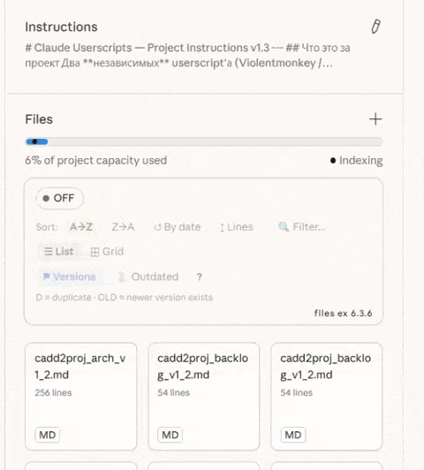
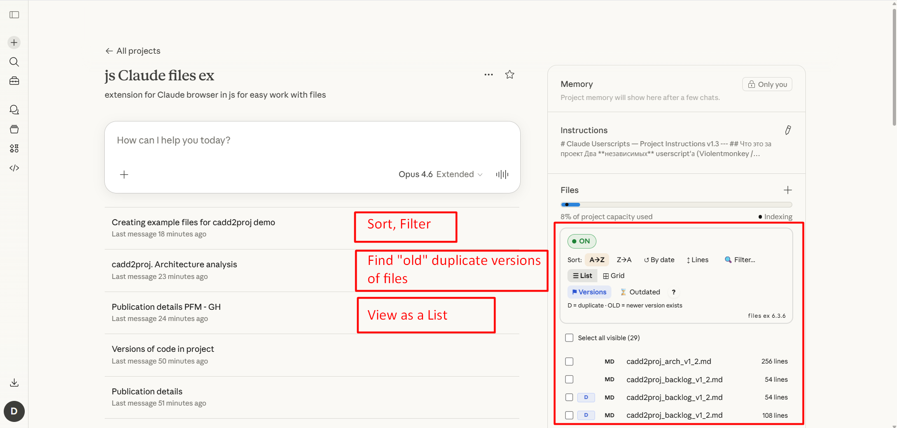
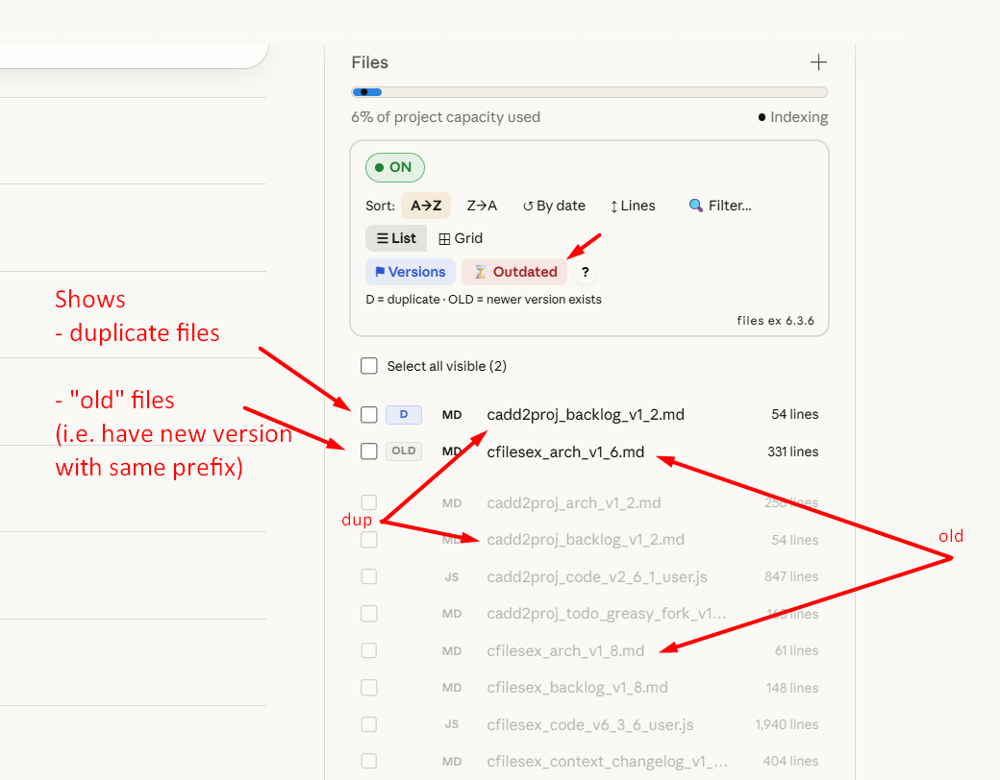

# Claude Project Files Manager

> Sort, filter, and manage files in Claude.ai projects with a powerful toolbar.

## Install

| Source | Link |
|--------|------|
| **Greasy Fork** | [Install ↗](https://greasyfork.org/en/scripts/570877-claude-project-files-sort-filter-list-view) |
| **GitHub** | [Install ↗](https://raw.githubusercontent.com/stoyanovd/claude-cfilesex/main/claude-project-files-manager.user.js) |

Requires [Violentmonkey](https://violentmonkey.github.io/), [Tampermonkey](https://www.tampermonkey.net/), or another userscript manager.

## Features

- 🔤 **Sort** — A→Z, Z→A, by date, by line count
- 🔍 **Filter** — instant text search across file names
- 📋 **List view** — compact rows instead of Claude's default grid
- 🏷️ **Version tracking** — auto-detects `_vX_Y` patterns, badges for outdated files
- ☑️ **Select All** — bulk selection with native checkboxes
- 📄 **Quick preview** — click file name to open preview panel
- 🔘 **ON/OFF** — disable without uninstalling

## Screenshots

## 🔒 Privacy & Security

- **ZERO network requests** — no data ever leaves your browser
- **Stores only UI preferences** (sort order, view mode) in local browser storage
- **Minimal permissions** — only GM_setValue / GM_getValue
- **No tracking, analytics, or telemetry**
- **No external code** — fully self-contained, no CDN dependencies
- **~2000 lines of commented, non-minified JavaScript** — what you see is what runs

See [SECURITY.md](SECURITY.md) for the complete security policy and verification guide.

## 🔍 Verify this script's safety

Before installing, you can audit the code — or ask an LLM to help:

> Audit this userscript for security and privacy issues.
> Check specifically for:
> 1. Any network requests (fetch, XMLHttpRequest, WebSocket, sendBeacon, new Image)
> 2. Any data exfiltration (cookies, localStorage reads beyond its own keys)
> 3. Any dynamic code execution (eval, Function constructor, setTimeout with strings)
> 4. Any external resource loading (@require, dynamic script/link/iframe injection)
> 5. Any access to sensitive page content (message text, file contents, auth tokens)
> 6. Any clipboard or input field access
> 7. What permissions (@grant) it requests and whether they match its stated purpose
> 8. What data it stores and where
>
> The script claims to: make ZERO network requests, store only UI preferences
> locally, and never read file contents or messages.
> Verify these claims against the actual code.
>
> Report: (a) any security concerns found, (b) confirmation of each
> claim that checks out, (c) overall risk assessment.

You can also compare the Greasy Fork version with the GitHub version to confirm they are identical.

## Compatibility

| Browser | Status |
|---------|--------|
| Brave + Violentmonkey | ✅ Primary dev environment |
| Chrome + Tampermonkey | Should work |
| Firefox + Violentmonkey | Should work |
| Edge | Should work |
| Safari + Userscripts | ⚠️ Untested |

## Also see

**[Claude — Add to Project](https://github.com/stoyanovd/claude-cadd2proj)** — Add artifact files to projects directly from chat with one-click buttons. [Install from Greasy Fork ↗](https://greasyfork.org/en/scripts/570883-claude-add-to-project)

## License

[MIT](LICENSE)